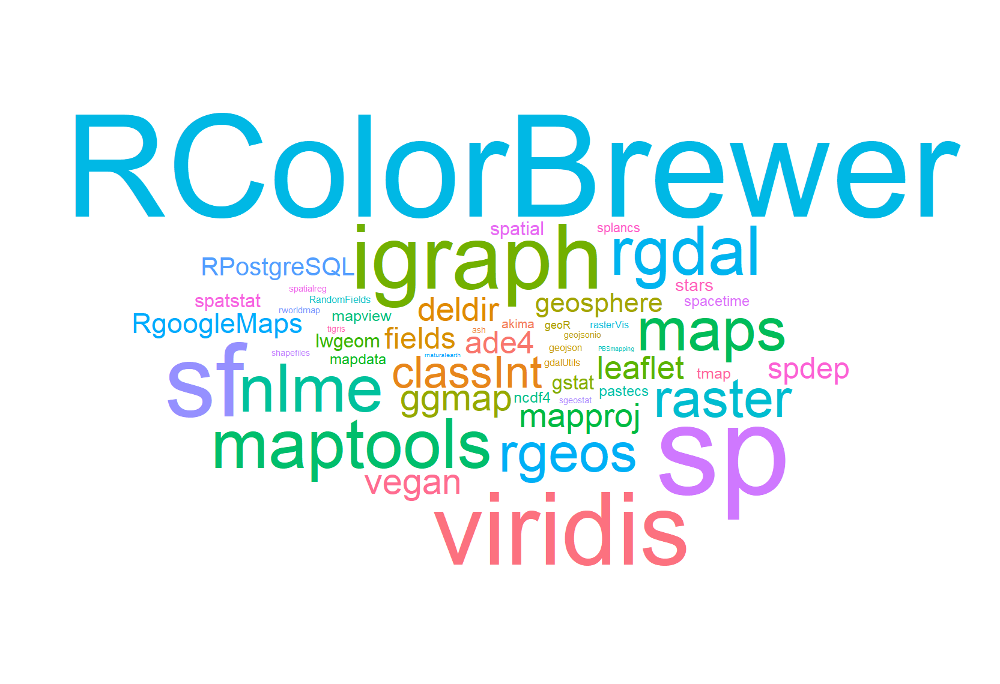
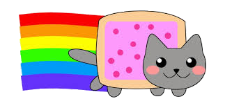
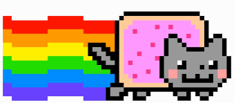

```{r setup, include=FALSE}
options(htmltools.dir.version = FALSE)
knitr::opts_chunk$set(
  echo = FALSE,
  fig.align = "center",
  message = FALSE,
  warning = FALSE
)

```


# Hoy hablaremos de:

- Introducción a R

- Conceptos básicos de datos espaciales

- Paquete sf

- Paquete raster

- Ejemplos prácticos

---

# Sobre mí

.right-column2[

```{r, out.width="80%", fig.align='right'}
knitr::include_graphics("img/ai.png")
```


```{r, out.width="60%", fig.align='center'}

```

]

--

- Stephanie Orellana (sporella@uc.cl)

--

- Ingeniera Agrónoma y Magíster en Recursos Naturales

--

- No aprendí a programar en ningún curso de la Universidad, sino que por necesidad.

--

- Partí trabajando con modelos mixtos de variables climáticas espacializadas, usando:
  + Arcgis
  + Excel
  + R

--

- Luego fui migrando completamente a R
  - Pero para "mirar" los rásters y vectores uso QGIS


---
# Básicos de R

--
- R es un lenguaje de **programación** y es un software libre

--
- RStudio es la interfaz de usuario más conocida (hace que R sea amigable e incluye herramientas para facilitar el trabajo)

--
- R es un lenguaje orientado a **objetos** en donde pueden aplicarse **funciones** a estos objetos.


```{r, out.width="80%", fig.align='right'}
knitr::include_graphics("https://conceptosclaros.com/wp-content/uploads/2017/06/r-rstudio.jpg")

```

---
# Por qué usar R

--
- Es un software libre y gratuito

--
- Permite hacer investigación reproducible:

--
  - El flujo de trabajo queda escrito en código
  - Los análisis se hacen dentro del mismo programa

--
- Es una herramienta potente y está en constante desarrollo de nuevas funcionalidades.

--
- Existe una gran comunidad alrededor del mundo que siempre está dispuesta a enseñar, responder preguntas y desarrollar nuevos paquetes.

--
  - Aprender a **buscar en Google** es primordial
  - **Twitter**
  
```{r, out.width="35%", fig.align='right', fig.cap="<a href='https://twitter.com/allison_horst'> @Allison Horst </a>"}  
knitr::include_graphics("https://jules32.github.io/useR-2019-keynote/img/horst-welcome_to_rstats_twitter.png")
```

---
# R Base v/s tidyverse

.pull-left[
```{r, out.width="90%"}
knitr::include_graphics("https://i.ytimg.com/vi/MCB4gNVfysU/maxresdefault.jpg")
```

- Programar con la sintaxis nativa de R
- Indices de objetos se realizan con: ` $ , [ ], [,] o [[]]`
- Funciones incluidas en el paquete base (base::)

]

.pull-right[
```{r, out.width="90%"}
knitr::include_graphics("https://miro.medium.com/max/4032/1*B-cwhqnFgGIbd9lWnzi_mQ.png")
```

- Grupo de paquetes diseñados para hacer ciencia de datos
- Busca una programación más intuitiva. Funciones como verbos.
- Todos los paquetes comparten una filosofía de diseño, gramática y estructuras de datos subyacentes.
- Operador "pipe" %>% 
]

---

# R Base v/s tidyverse

```{r, eval=F, echo=T}
# Seleccionar columnas
## R base

iris$Sepal.Length
iris[, c("Petal.Length", "Sepal.Length", "Species")]


# tidyverse
library(dplyr)

iris %>% 
  select(Petal.Length, Sepal.Length, Species)
```


```{r, out.width="60%"}
knitr::include_graphics("https://image.slidesharecdn.com/emilytidyversepresentation-180205195912/95/the-lesser-known-stars-of-the-tidyverse-5-638.jpg?cb=1517860826")
```

--

.pull-center[

¡Para procesar datos espaciales necesitaremos las dos formas!

```{r, out.width="25%"}
knitr::include_graphics("https://cdn160.picsart.com/upscale-235481347027212.png?type=webp&to=min&r=1024")
```


]

---
class: middle

# ¡Vamos a la parte espacial!

```{r, out.width="30%", fig.align='right'}
knitr::include_graphics("https://encrypted-tbn0.gstatic.com/images?q=tbn%3AANd9GcRtbePUpnq_UKJKFI_yW88HotGcL3SHOdrXAZJCNtRyyNsUKss1&usqp=CAU")
```


---

# R vs GIS tradicionales

 |R | SIG Tradicionales
--------|---------|---------
1 | Código ilimitado, se pueden mezclar diferentes paquetes para diferentes operaciones y análisis (incluso puedes hacer tus reportes y presentaciones en R). | Algunos como ArcGis y QGis tienen una consola de código en Python.
--

2 | Visualización de datos espaciales no es tan detallada como en un SIG tradicional, aunque existen paquetes para explorar de forma dinámica. | Visualización rápida de grandes vectores y creación de estos con herramientas manuales especializadas.
--

3 | Se puede hacer todo tipo de análisis y gráficos de la información espacial (ej: `ggplot2`). | Sólo vistas de mapas e histogramas.
--

4 | Se pueden programar procesos iterativos para hacer la misma acción muchas veces (se puede programar todo). | Procesos en "batch" siguen siendo manuales.
--

5 | Fácil análisis de las tablas de atributos (se puede aplicar dplyr y contenidos del libro R for Data Science). | Análisis limitado de tablas de atributos.
--

6| Permite reproducibilidad, queda todo por escrito. | Poco reproducible, nada (o muy poco) queda por escrito.


---
# R spatial 

[CRAN TASK VIEW](https://cran.r-project.org/web/views/Spatial.html)

```{r embed, out.extra='style="border: none;"', out.width='90%'}
knitr::include_url('https://cran.r-project.org/web/views/Spatial.html')
```

---
# Paquetes más descargados de #rspatial

```{r, out.width="90%", fig.align='center'}


```

.footnote[
[*] 50 paquetes más descargados con la etiqueta RSpatial desde 2015 
  
]

---
class: middle

# Conceptos básicos a tomar en cuenta

```{r, out.width="30%", fig.align='right'}

```


---
# 1) Tipo de dato/archivo

.pull-left[

.h2[VECTORES]

.p-caption[
```{r, out.width="55%", fig.cap="Fuente: <a href='http://katiejolly.io/rnorth-19'> @Katie Jolly </a>"}
knitr::include_graphics("img/vector.png")

```
]

```{r, out.width="40%"}



```
.small[
- Mediciones de campo
- Estaciones meteorológicas
- Caminos
- Rutas GPS
- Comunas
- Regiones
- Áreas de estudio
]
]

.pull-right[
.h2[RÁSTER]
.p-caption[
```{r, out.width="62%", fig.cap="Fuente: <a href='http://katiejolly.io/rnorth-19'> @Katie Jolly </a>"}
knitr::include_graphics("img/raster.png")

```
]

```{r, out.width="40%"}



```

.small[
- Imágenes satelitales
- Imágenes aéreas
- Modelos de elevación digital
- Productos de tipos de usos de suelo
- Datos (numéricos o categóricos) en grillas regulares
]
]


---
# Vectores: paquete "sf"

--
- Es el paquete "más moderno" para trabajar con vectores.

--
- Actúa bajo la lógica de "simple features" en donde un objeto espacial se divide en dos componentes:
  - data.frame (tabla de atributos)
  - geometría **geom** (información espacial)

--
- Es compatible con **tidyverse**

```{r, out.width="45%", fig.align='right', fig.cap="<a href='https://twitter.com/allison_horst'> @Allison Horst </a>"}  
knitr::include_graphics("https://user-images.githubusercontent.com/520851/50280460-e35c1880-044c-11e9-9ed7-cc46754e49db.jpg")
```


---
# Cargar datos con sf

```{r, eval=T, echo=T, out.width="50", out.height="30%"}
library(sf)

# Cargar datos
## Poligonos
provincias <- read_sf("data/provincias/provincias.shp") #<<
provincias
```

---
# Cargar datos con sf

```{r, eval=T, echo=T, out.width="90", out.height="70%"}
## Puntos
aeropuetos <- read_sf("data/aero1/aero1.shp") #<<
aeropuetos

```

---
# Rásters: paquete "raster"

--
- Es el paquete más utilizado para el procesamiento de rásters, aunque se está desarrollando el paquete `stars` (del mismo creador de `sf`) el cual permite el procesamiento de ráster en tidyverse

--
- El paquete ráster actúa bajo la lógica de una matriz de datos en donde el inicio se encuentra en el extremo superior izquierdo.

--
- Si sabes cómo procesar matrices con R Base, es fácil acceder a los valores de un ráster.

--
- El paquete tiene funciones para leer, transformar, analizar y guardar rásters.

```{r, out.width="30%"}
knitr::include_graphics("https://i.stack.imgur.com/xeqec.png")
```

---
# Cargar datos con raster


```{r, eval=T, echo=T, out.width = "90", out.height="30%"}
library(raster)

# Cargar datos
## Ráster individual
lst_01 <- raster("data/raster/lst_01.tif") #<<
lst_01
```


---
# Cargar datos con raster

```{r, eval=T, echo=T, out.width="90", out.height="30%"}
library(raster)

# Cargar datos
## Grupos de rásters

l <- list.files("data/raster/", full.names = T)
lst <- stack(l) #<<
lst
```

---
# 2) Proyección Espacial (CRS)


- Es fundamental conocer en qué proyección espacial se encuentran nuestros datos. Las proyecciones están determinadas por un CRS (coordinate reference system).

--

- Cada CRS puede estar definido por un EPSG (sigla de European Petroleum Survey Group) el cual es un código que se encuentra registrado en un listado de parámetros geodésicos (https://spatialreference.org/ref/)

--

- Si quiero hacer operaciones espaciales, todas las capas deben tener el mismo sistema de proyección.

--

- En Chile, los sistemas de proyección más usados son:
  - EPSG:4326: WGS 84
  - EPSG:32719: WGS 84 / UTM zone 19S
  - EPSG:3857: WGS84 Web (Pseudo)Mercator (Auxiliary Sphere)
  - EPSG:24879: PSAD56 / UTM zone 19S


---
# 2) Proyección espacial

```{r}
knitr::include_app("img/proj_face1.mp4")
```

[Andy Woodruff: Projection Face!](http://bl.ocks.org/awoodruff/9216081?utm_campaign)

---
# Cambiar proyección de un vector


```{r, eval=T, echo=T, results='hold', out.width="50"}
# Cambiar proyección
## Proyección actual 
st_crs(provincias)$epsg
st_crs(provincias)$proj4string
```

--

```{r, eval=T, echo=T, results='hold', out.width="50"}
## Cambiar a Pseudo Mercator
provincias_psm <- st_transform(provincias, crs = 3857) #<<
st_crs(provincias_psm)$epsg
st_crs(provincias_psm)$proj4string
```

---
# Cambiar proyección de un ráster


```{r, echo=T}
# Conocer CRS actual
crs(lst_01)
```

```{r, echo=T, results="hold"}
# Proyectar a UTM
lst_01_psm <- projectRaster(lst_01, crs = crs("+init=epsg:3857"))#<<
crs(lst_01_psm)

```

---
# 3) Extensión y resolución espacial

--
- Muy importante cuando trabajo con rásters.

--
- Si mis rásters no tienen la misma extensión (bbox) espacial, no pueden tratarse como stacks.
  - Tampoco si es que tienen diferente resolución

--

.pull-left[
```{r, echo=T}
extent(lst_01)
extent(lst_01_psm)
```
]

--
.pull-right[
```{r, echo=T}
res(lst_01)
res(lst_01_psm)
```
]
---
class:: middle

# Visualización

---
# Cortar Vectores por atributos y visualizar

```{r, eval=T, echo=T}
library(sf)
library(tidyverse)
# Seleccionar sólo comunas en el departamento de Cochabamba
provincias_coch <- provincias %>%
  filter(NOM_DEP == "Cochabamba")#<<

```

--

```{r, eval=F, echo=T}
## Gráfico rápido
plot(provincias_coch)
```

--

```{r, results="asis", echo=F, fig.width=10, fig.height=4}
## Gráfico rápido
plot(provincias_coch)
```

---
# Vectores y ggplot2


```{r, eval=F, echo=T}
## Gráfico con ggplot
library(ggplot2)

ggplot(provincias_coch) +
  geom_sf(aes(fill = NOM_PROV))#<<

```

--

```{r, results="asis", echo=F, fig.width=10, fig.height=5}
## Gráfico con ggplot
library(ggplot2)

ggplot(provincias_coch) +
  geom_sf(aes(fill = NOM_PROV))#<<

```

---
# Cortar rásters por máscaras y visualizar

```{r, echo=T, eval=T}
# Creo máscara
provincias_lapaz_psm <- provincias %>%
  filter(NOM_DEP == "La Paz") %>%     
  st_transform(crs = 3857)

m_lst_01 <- mask(lst_01_psm, provincias_lapaz_psm) #<<
```

```{r, echo=T, out.width="40%"}
plot(m_lst_01)
```

---
# Rásters y ggplot2

```{r, echo=T, out.width="40%"}
# Convertir a tabla

rt <- data.frame(rasterToPoints(m_lst_01))

ggplot() +
 geom_raster(data = rt , aes(x = x, y = y, fill=lst_01))+
  scale_fill_gradientn(colours=rev(terrain.colors(15)))+
  coord_equal()
```

---
# leaflet

```{r out.width='100%', fig.height=6, eval=require('leaflet')}
library(sf)
library(leaflet)

provincias_lapaz_geo <- st_simplify(st_transform(provincias_lapaz_psm, crs = 4326), dTolerance = 0.01)
pal <- colorFactor(scales::hue_pal()(15), levels = unique(provincias_lapaz_geo$NOM_PROV))

labels <- sprintf(
  "<strong>%s</strong><br/>Provincia: %s",
  provincias_lapaz_geo$NOM_PROV, provincias_lapaz_geo$NOM_PROV
) %>% lapply(htmltools::HTML)

leaflet(provincias_lapaz_geo) %>% 
  addTiles() %>% 
  addPolygons(fillColor = ~pal(NOM_PROV),
              weight = 2,
              opacity = 1,
              color = "white",
              fillOpacity = 0.7,
              label = labels)
```

---
class: middle, invert

# Recomendaciones

---
# Libros
.pull-left[
```{r, fig.cap=" <a href='https://geocompr.robinlovelace.net/'>Geocomputation with R</a>"}
knitr::include_graphics("https://geocompr.robinlovelace.net/images/cover.png")
```
]

.pull-right[
```{r, fig.cap=" <a href='https://r4ds.had.co.nz/'>R for data science</a>"}
knitr::include_graphics("https://d33wubrfki0l68.cloudfront.net/b88ef926a004b0fce72b2526b0b5c4413666a4cb/24a30/cover.png")
```
]

---
# A quién seguir

```{r, out.width="20%", fig.align="right"}
knitr::include_graphics("https://ohmygeek.net/wp-content/uploads/2012/06/twitter-logo-jun-2012.jpg")
```

- https://twitter.com/CivicAngela  `#rspatialchat`

- https://twitter.com/Paula_Moraga_

- https://twitter.com/hadleywickham

- https://twitter.com/edzerpebesma

- https://twitter.com/RogerBivand

- https://twitter.com/jakub_nowosad

- `#rspatial`

- `#rstats`

---
# Recomendaciones generales

--
- Si se demoró mucho en cargar, mejor no visualizar.

--

- Cuando se trabaja con datos muy grandes, mejor hacer todas las pruebas con una selección pequeña.

--

- R tampoco es mágico, si le damos las intrucciones incorrectas, no obtendremos el resultado esperado.

--

- R es rápido, pero hay procesos que se demoran. Esperar.

```{r, out.width="40%"}
knitr::include_graphics("https://image.freepik.com/vector-gratis/lego-isometrico_71884-8.jpg")
```

